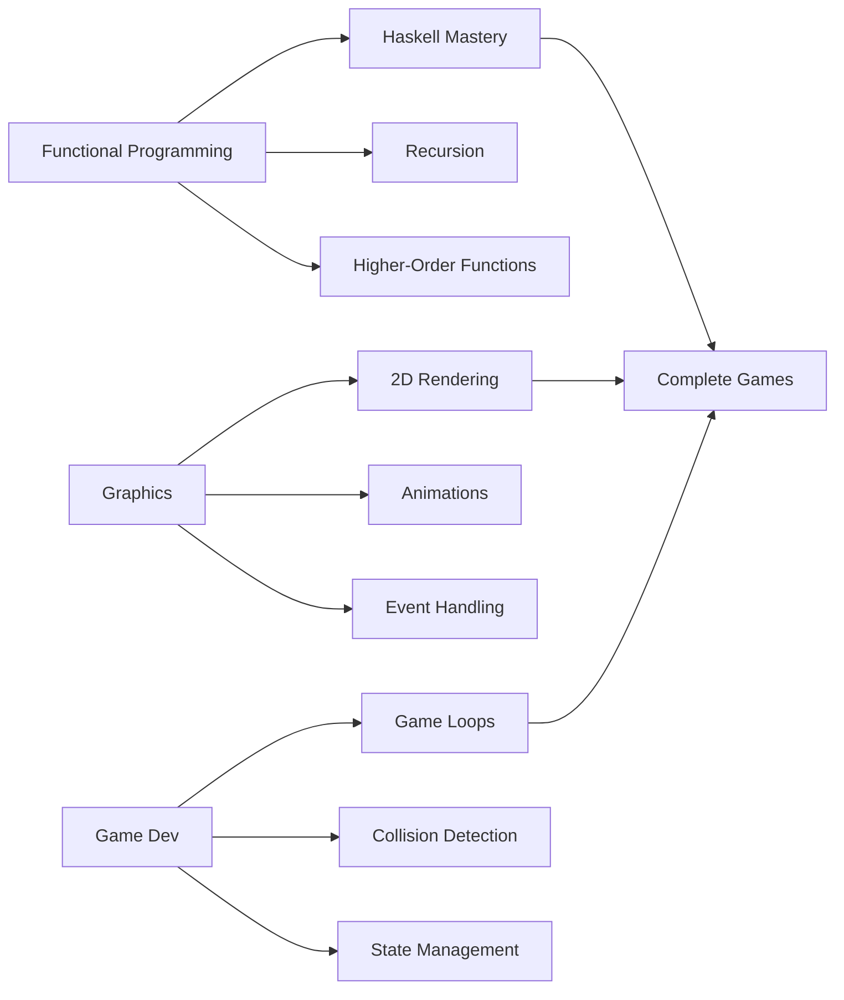

<div align="center">

# 🎮 LI1 - Computer Labs I

### Functional Programming & Game Development with Haskell


*Introduction to functional programming through interactive graphics and game development*

[📂 Repository](../..) • [🎓 Course Info](#about) • [🚀 Quick Start](#getting-started)

</div>

---

## 📖 About

**LI1 (Laboratórios de Informática I)** is the first computer labs course at University of Minho, serving as an introduction to **functional programming** using Haskell and the development of **interactive graphical applications** with the Gloss library.

This repository contains:
- 📝 Practical worksheets and exercises
- 🎨 Gloss graphics examples and experiments
- 🕹️ Mini-games and interactive applications
- 🎯 Class assignments and solutions
- 🏆 Final course project

### 🎯 Learning Objectives

- Master **functional programming paradigm** fundamentals
- Understand **recursion**, **higher-order functions**, and **list comprehensions**
- Work with **algebraic data types** and **pattern matching**
- Develop **2D graphics and animations** using Gloss
- Build complete **interactive games** from scratch
- Apply **software engineering** practices in functional contexts

---

## 🗂️ Repository Structure

```
LI1/
├── Fichas-Questões/          # Worksheets & Practice Exercises
│   ├── Code/                 # Class code examples
│   │   ├── Apontamentos.hs   # Class notes
│   │   ├── Aula1.hs          # Week 1 examples
│   │   └── Aula2.hs          # Week 2 examples
│   ├── Ficha*.hs             # Weekly worksheets
│   ├── Exemplo*.hs           # Basic examples
│   ├── Gloss_Exemplo*.hs     # Gloss graphics examples
│   ├── DonkeyKong.hs         # Donkey Kong clone example
│   ├── JumpObstacle.hs       # Jump game example
│   ├── Exemplo_Menu.hs       # Menu system example
│   └── Exemplo_Records.hs    # Records usage example
└── Projeto/                  # Final Course Project
    └── 2023li1g061/          # Primate Kong (Group Project)
        ├── src/              # Source code
        ├── lib/              # Libraries
        ├── doc/              # Documentation
        └── test/             # Test suites
```

---

## 🛠️ Technologies

<div align="center">

### Core Stack

| Technology | Purpose | Version |
|------------|---------|---------|
|  | Programming Language | GHC 9.x |
|  | 2D Graphics Library | Latest |
|  | Build System | Latest |

</div>

### 📚 Key Libraries

```haskell
import Graphics.Gloss              -- 2D graphics and animation
import Graphics.Gloss.Interface.Pure.Game  -- Game state management
import Graphics.Gloss.Data.Picture  -- Picture primitives
```

---

## 📚 Course Content

### 🔤 Haskell Fundamentals

<table>
<tr>
<td width="50%">

**Basic Concepts**
- ✅ Functions and expressions
- ✅ Types and type inference
- ✅ Pattern matching
- ✅ Guards and conditionals
- ✅ List operations
- ✅ Tuples and records

</td>
<td width="50%">

**Advanced Topics**
- ✅ Recursion patterns
- ✅ Higher-order functions
- ✅ Lambda expressions
- ✅ List comprehensions
- ✅ Algebraic data types
- ✅ Custom type classes

</td>
</tr>
</table>

### 🎨 Graphics Programming with Gloss

```haskell
-- Simple circle example
circle :: Picture
circle = Color red (Circle 50)

-- Animation example
animation :: Float -> Picture
animation t = Rotate (t * 30) (Circle 100)

-- Interactive game loop
gameLoop :: Event -> GameState -> GameState
gameLoop event state = case event of
  EventKey (Char 'w') Down _ _ -> moveUp state
  EventKey (Char 's') Down _ _ -> moveDown state
  _                            -> state
```

**Covered Topics:**
- 🎨 Basic shapes and transformations
- 🖼️ Picture composition and layering
- ⏱️ Time-based animations
- 🎮 Event handling (keyboard, mouse)
- 🎭 Game state management
- 🔄 Real-time rendering loops

### 🕹️ Game Development

**Mini-Projects:**
- 🦍 **Donkey Kong Clone** - Platform game mechanics
- 🏃 **Jump Obstacle** - Endless runner with collision detection
- 📋 **Menu System** - Interactive UI navigation
- 🎯 **Primate Kong** - Final project (complete game)

---

## 🚀 Getting Started

### Prerequisites

```bash
# Install GHC and Cabal (Haskell Platform)
sudo apt install haskell-platform    # Ubuntu/Debian
brew install ghc cabal-install        # macOS

# Install Gloss library
cabal update
cabal install gloss
```

### Running Examples

#### Compile and Run

```bash
# Navigate to the exercises directory
cd Fichas-Questões/

# Compile a Haskell file
ghc -o example Gloss_Exemplo0.hs

# Run the executable
./example
```

#### Interactive Mode (GHCi)

```bash
# Start GHCi with Gloss loaded
ghci Gloss_Exemplo0.hs

# Run the main function
> main
```

#### Project Setup

```bash
# Navigate to project directory
cd Projeto/2023li1g061/

# Build the project
cabal build

# Run the game
cabal run
```

---

## 🎮 Featured Examples

### 🔵 Gloss Example 0 - Basic Shapes

Simple demonstration of circle creation and composition with colors.

**Features:**
- Circle primitives
- Color application
- Picture translation
- Multi-picture composition

### 🦍 Donkey Kong Clone

A simplified version of the classic arcade game demonstrating:
- Sprite-based graphics
- Platform collision detection
- Character movement and jumping
- Level design

### 🏃 Jump Obstacle Game

An endless runner showcasing:
- Procedural obstacle generation
- Physics simulation (gravity, jumping)
- Score tracking
- Game over conditions

### 📋 Menu System

Interactive menu implementation featuring:
- State-based navigation
- Keyboard input handling
- Visual feedback
- Scene transitions

---

## 🏆 Final Project - Primate Kong

The final course project is a complete game developed in a team, featuring:

- 🎮 **Full game mechanics** - Movement, jumping, climbing
- 🎨 **Custom graphics** - Original sprites and animations
- 🔊 **Audio system** - Sound effects and music
- 📊 **Score system** - Points, lives, levels
- 🏅 **Multiple levels** - Progressive difficulty
- 💾 **Save/Load** - Game state persistence
- 🎯 **Win/Lose conditions** - Complete gameplay loop

**Technologies:**
- Haskell with Gloss for graphics
- Cabal for project management
- Custom data structures for game state
- Modular architecture with multiple modules

---

## 📝 Worksheets Overview

| Worksheet | Topics | Key Concepts |
|-----------|--------|--------------|
| **Ficha 1** | Basic Functions | Definitions, types, simple recursion |
| **Ficha 2** | Lists | List operations, pattern matching, recursion |
| **Ficha 3** | Higher-Order | `map`, `filter`, `foldr`, lambdas |
| **Ficha 4** | Comprehensions | List comprehensions, guards, generators |
| **Ficha 5** | Data Types | ADTs, pattern matching, custom types |
| **Ficha 6** | Graphics | Gloss basics, shapes, transformations |
| **Ficha 7** | Animation | Time-based animation, continuous functions |
| **Ficha 8** | Interaction | Event handling, game state updates |
| **Ficha 9** | Game Logic | Collision detection, physics, game loops |

---

## 💡 Key Concepts Learned

### Functional Programming

```haskell
-- Recursion
factorial :: Int -> Int
factorial 0 = 1
factorial n = n * factorial (n-1)

-- Higher-order functions
applyTwice :: (a -> a) -> a -> a
applyTwice f x = f (f x)

-- List comprehensions
squares = [x^2 | x <- [1..10], odd x]

-- Pattern matching
head' :: [a] -> a
head' [] = error "Empty list"
head' (x:_) = x
```

### Graphics Programming

```haskell
-- Basic window setup
window :: Display
window = InWindow "My Game" (800, 600) (100, 100)

-- Game state
data GameState = GameState
  { playerPos :: (Float, Float)
  , score     :: Int
  , obstacles :: [Obstacle]
  }

-- Render function
render :: GameState -> Picture
render state = Pictures
  [ drawPlayer (playerPos state)
  , drawScore (score state)
  , drawObstacles (obstacles state)
  ]
```

---

## 🎯 Skills Acquired

<div align="center">



</div>

### Technical Skills

✅ **Functional Thinking** - Solving problems without mutable state  
✅ **Type Systems** - Leveraging strong static typing  
✅ **Recursion Mastery** - Elegant solutions without loops  
✅ **Graphics Programming** - 2D rendering and transformations  
✅ **Game Architecture** - Structuring interactive applications  
✅ **Event-Driven Programming** - Handling user input  
✅ **Testing** - Property-based testing with QuickCheck  

---

## 📊 Academic Performance

```
📚 Course Load: 6 ECTS
⏱️ Weekly Hours: ~8 hours (4h labs + 4h study)
📝 Assessment:
   - Practical Worksheets: 20%
   - Mini-tests: 20%
   - Final Project: 40%
   - Final Exam: 20%
```

---

## 🔗 Resources

### Official Documentation
- 📖 [Haskell Documentation](https://www.haskell.org/documentation/)
- 🎨 [Gloss Library](http://gloss.ouroborus.net/)
- 📚 [Learn You a Haskell](http://learnyouahaskell.com/)

### Recommended Reading
- 📕 **Learn You a Haskell for Great Good!** - Miran Lipovača
- 📗 **Real World Haskell** - Bryan O'Sullivan
- 📘 **Haskell Programming from First Principles** - Christopher Allen

### Useful Tools
- 🛠️ [GHCi](https://downloads.haskell.org/ghc/latest/docs/html/users_guide/ghci.html) - Interactive Haskell REPL
- 🔍 [Hoogle](https://hoogle.haskell.org/) - Haskell API search engine
- 📦 [Hackage](https://hackage.haskell.org/) - Haskell package repository

---

## ⚠️ Important Notes

### Compilation

Some files have associated `.hi` (interface) files and compiled binaries:
- These are **automatically generated** during compilation
- Not included in version control (see `.gitignore`)
- Regenerated when you compile the source files

### Running on Different Systems

**Windows:**
```bash
ghc -o example.exe Gloss_Exemplo0.hs
example.exe
```

**Linux/macOS:**
```bash
ghc -o example Gloss_Exemplo0.hs
./example
```

---

## 🤝 Contributing

These exercises and projects were completed during the 2023/2024 academic year. While this is an archive of past work, feel free to:

- 🐛 Report issues or typos
- 💡 Suggest improvements
- 📖 Use as learning reference (with proper attribution)

**Note:** Please respect academic integrity - use this as a reference, not for direct submission.

---

## 📜 License

This work is part of the University of Minho academic archives and is subject to the repository's [Educational Use License](../../../LICENSE).

**For current students:** Use responsibly as a learning reference only.

---

<div align="center">

### 🎓 Part of UMinho Software Engineering Archives

**Developed in:** 2023/2024 Academic Year  
**Course Code:** LI1  
**Department:** Informatics Engineering  
**University:** Universidade do Minho

[⬆️ Back to Top](#-li1---computer-labs-i)

</div>
