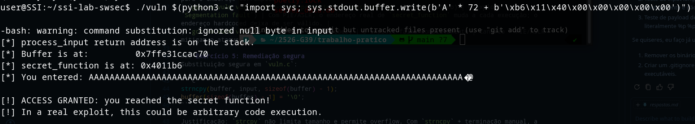

# Relatório - Semana 11: Vulnerabilidades de Segurança de Memória

## Parte A: Buffer Overflow de Stack

### Exercício 1: Compilação sem mitigações
Flags usadas e objetivo:
- `-fno-stack-protector`: desativa stack canaries, permitindo sobrescrever o return address sem deteção.
- `-z execstack`: torna a stack executável (relevante para execução de shellcode).
- `-no-pie`: desativa PIE, logo os endereços do binário ficam fixos nessa execução.
- `-g`: adiciona símbolos de debug para análise com GDB.

### Exercício 2: Execução normal e exploração com GDB
Valores observados na VM:
1. Endereço do buffer na stack: `0x7ffce6e2c180`
2. Return address guardado (valor em saved RIP): `0x4012c7`
3. Distância entre início do buffer e return address: `72 bytes` (64 + 8)
4. Endereço de `secret_function`: `0x4011b6`

### Exercício 3: Desencadear o overflow
- Offset usado: `72 bytes`
- Endereço de `secret_function` em little-endian: `\xb6\x11\x40\x00\x00\x00\x00\x00`
- Comando:

```bash
./vuln $(python3 -c "import sys; sys.stdout.buffer.write(b'A' * 72 + b'\xb6\x11\x40\x00\x00\x00\x00\x00')")
```

Resultado: exploit bem-sucedido, com a mensagem `ACCESS GRANTED: you reached the secret function!`.



### Exercício 4: Efeito das mitigações

| Flags de compilação | Comportamento | Explicação |
| :--- | :--- | :--- |
| `gcc -o vuln vuln.c -z execstack -no-pie -g` (canary ativo) | O exploit falha com `*** stack smashing detected ***: terminated` | O canary é alterado durante o overflow e o programa aborta antes de retornar para o endereço corrompido. |
| `gcc -o vuln vuln.c -fno-stack-protector -z execstack -g` (PIE/ASLR ativo) | O exploit falha (ex.: `Segmentation fault`) | Com PIE/ASLR, o endereço real de `secret_function` muda a cada execução; o endereço hardcoded deixa de ser válido. |
| `gcc -o vuln vuln.c -g` (todas as mitigações) | O exploit falha completamente | Canário + PIE/ASLR mitigam o ataque em conjunto. |

### Exercício 5: Remediação segura
Substituição segura em `vuln.c`:

```c
strncpy(buffer, input, sizeof(buffer) - 1);
buffer[sizeof(buffer) - 1] = '\0';
```

Justificação: `strcpy` não limita tamanho e permite overflow. Com `strncpy` + terminação manual, a escrita fica limitada ao tamanho do buffer.

---

## Parte B: Vulnerabilidade de String de Formato

### Exercício 6: Compilação e avisos
1. Aviso do GCC: `warning: format not a string literal and no format arguments [-Wformat-security]`
2. Interpretação: a entrada do utilizador está a ser usada como formato no `printf`, o que é inseguro.
3. Nota: avisos de compilador ajudam bastante, mas não substituem testes dinâmicos nem revisão de lógica.

### Exercício 7: Desencadear a vulnerabilidade
1. Com input `%p %p %p ...`, o programa imprime endereços/valores de memória em vez de texto normal.
2. Motivo: `printf` é variádica; ao encontrar `%p`, `%x`, etc., tenta ler argumentos da stack/registos mesmo sem eles terem sido passados.
3. `%x` vs `%p`: `%x` mostra inteiros de 32 bits; `%p` mostra ponteiros (adequado para 64 bits).

### Exercício 8: Localizar um valor na stack
Comando usado:

```bash
./fmtvuln "$(python3 -c "print('%p ' * 30, end='')")"
```

Resultado na VM: o sentinela `0xcafebabe` apareceu na `8ª` posição.

Risco demonstrado: a falha permite leak de informação da stack (dados sensíveis, canaries, endereços), o que facilita ataques seguintes.

### Exercício 9: Remediação segura
Linha corrigida:

```c
printf("%s", input);
```

Justificação: ao usar formato literal `%s`, a entrada passa a ser tratada apenas como dados, sem interpretar especificadores como `%p` ou `%x`.